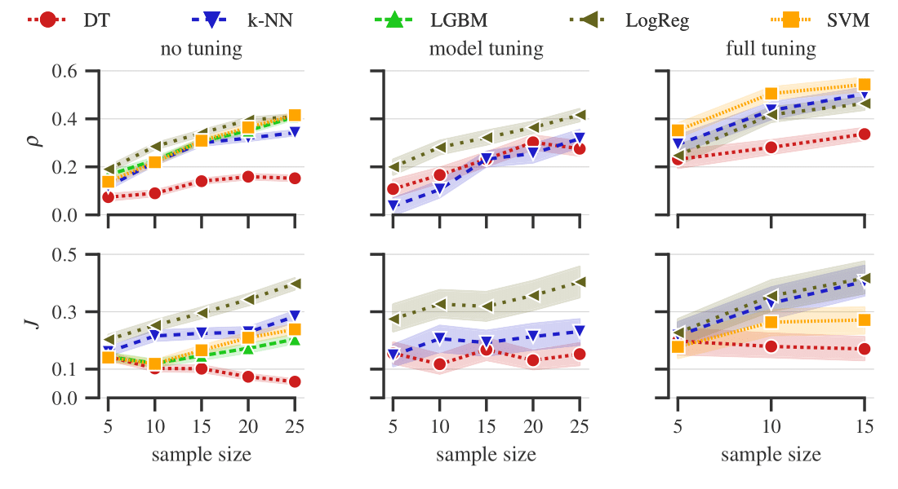

# A benchmark of categorical encoders for binary classification

Repository for the paper _A benchmark of categorical encoders for binary classification_.

# Replicating the experimental results

## Installation

### Requirements
1. Install [Python 3.8.10](https://www.python.org/downloads/release/python-3810/);
2. create and activate a [virtual environment](https://python.land/virtual-environments/virtualenv), we call it `venv`;
3. install dependencies with `pip install -r requirements`.

### Optional requirements
Our implementations of GLMM-based encoders require the [rpy2 module](https://pypi.org/project/rpy2/) and R to be installed.
The R version we used is `4.2.2`, with the `lme4` package version `1.1-31`.\
To aggregate results with Kemeny aggregation, install and configure [Gurobi](https://www.gurobi.com/) and its [Python API](https://pypi.org/project/gurobipy/).

## Execute the experiments
1. Open a terminal and navigate to `EncoderBenchmarking`;
2. activate `venv`;
3. configure the experimental parameters by editing `src\config.py`;
4. run `src\main_full_tuning.py`, `src\main_model_tuning.py`, and `src\main_no_tuning.py`; 
5. after execution, results are stored in `analysis\experimental_results`.

## Analysis and figures
All of the code necessary to reproduce the analysis and the plots is available in the `experimental_results` folder.

# Add custom Encoder, ML model, quality metric
The objects must implement the scikit-learn API:
- an `Encoder` implements the `fit`, `transform`, and `fit_transform` methods;
- a `Model` implements the `fit`, `predict`, and `fit_predict` methods;
- a `quality metric` is a function with signature `(y_true, y_pred) -> float`.
Edit the corresponding parameters in `src\config.py` to add the objects to the benchmark. 

[//]: # (## Aggregation strategy)

[//]: # (Modify `src.rank_utils.BaseAggregator` with a custom aggregation strategy: )

[//]: # (1. add the method, which operates on the `df` and `rf` dataframes, described in `src.rank_utils.BaseAggregator`;)

[//]: # (2. the method updates `self.aggrf` with a new column of scores for the ranking &#40;they do not have to be actual rankings&#41;)

[//]: # (3. add your method name and method to `self.supported_strategies` and `self.increasing`. The key of `self.increasing` must be the same as in `self.aggrf`)

  
