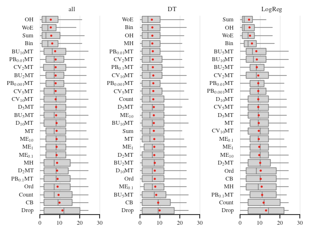

# A benchmark of categorical encoders for binary classification

Repository for the paper [A benchmark of categorical encoders for binary classification](https://arxiv.org/abs/2307.09191), 
accepted at NeurIPS 2023, Datasets and Benchmarks track.

<figure>
  
  <figcaption><em>
        Ranks of encoders conditional on the model (lower rank is better).
        Sum, One-Hot, WoE, and Binary encoders are consistently among the best for logistic regression (LogReg), 
        while no encoder is clearly on top for decision tree (DT). 
        Even considering all the models (LogReg, DT, kNN, SVM, and LGBM), Sum, One-Hot, WoE, and Binary encoders are the best ones.
  </em></figcaption>
</figure>

# Replicating the experimental results

## Installation

### Requirements
1. Install [Python 3.8.10](https://www.python.org/downloads/release/python-3810/);
2. create and activate a [virtual environment](https://python.land/virtual-environments/virtualenv), we call it `venv`;
3. install dependencies with `pip install -r requirements`.

### Optional requirements
Our implementations of GLMM-based encoders require the [rpy2 module](https://pypi.org/project/rpy2/) and R to be installed.
The R version we used is `4.2.2`, with the `lme4` package version `1.1-31`.\
To aggregate results with Kemeny aggregation, install and configure [Gurobi](https://www.gurobi.com/) and its [Python API](https://pypi.org/project/gurobipy/).

## Configure, add to, and run the experiments
In [the experiments directory](https://github.com/DrCohomology/EncoderBenchmarking/tree/main/src).

## Analysis and figures
All of the code necessary to reproduce the analysis and the plots is available in [the analysis directory](https://github.com/DrCohomology/EncoderBenchmarking/tree/main/analysis).

[//]: # (## Aggregation strategy)

[//]: # (Modify `src.rank_utils.BaseAggregator` with a custom aggregation strategy: )

[//]: # (1. add the method, which operates on the `df` and `rf` dataframes, described in `src.rank_utils.BaseAggregator`;)

[//]: # (2. the method updates `self.aggrf` with a new column of scores for the ranking &#40;they do not have to be actual rankings&#41;)

[//]: # (3. add your method name and method to `self.supported_strategies` and `self.increasing`. The key of `self.increasing` must be the same as in `self.aggrf`)

  
